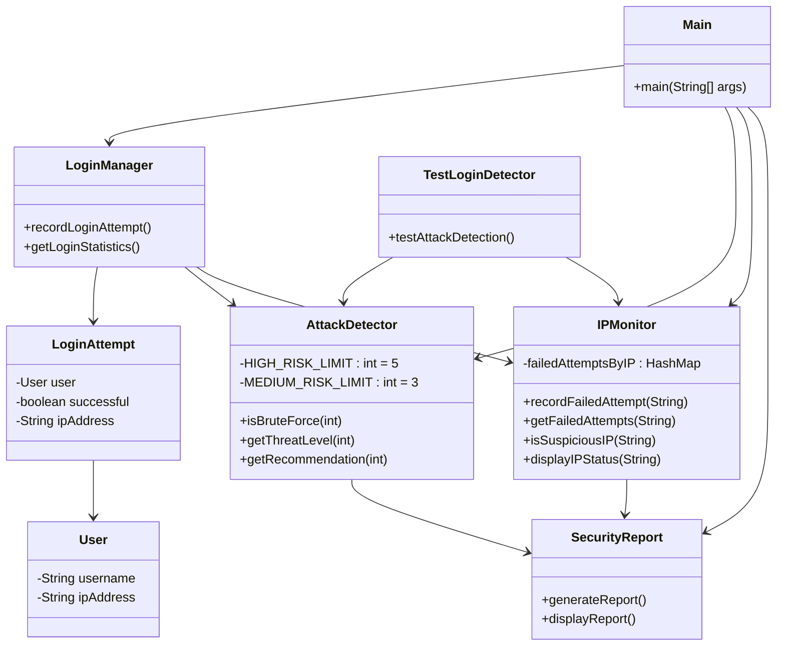

# Class Diagram

```mermaid
classDiagram

class Main {
    +main(String[] args)
}

class User {
    -String username
    -String ipAddress
}

class LoginAttempt {
    -User user
    -boolean successful
    -String ipAddress
}

class LoginManager {
    +recordLoginAttempt()
    +getLoginStatistics()
}

class AttackDetector {
    -HIGH_RISK_LIMIT : int = 5
    -MEDIUM_RISK_LIMIT : int = 3
    +isBruteForce(int)
    +getThreatLevel(int)
    +getRecommendation(int)
}

class IPMonitor {
    -failedAttemptsByIP : HashMap
    +recordFailedAttempt(String)
    +getFailedAttempts(String)
    +isSuspiciousIP(String)
    +displayIPStatus(String)
}

class SecurityReport {
    +generateReport()
    +displayReport()
}

class TestLoginDetector {
    +testAttackDetection()
}

Main --> LoginManager
Main --> AttackDetector
Main --> IPMonitor
Main --> SecurityReport

LoginManager --> LoginAttempt
LoginAttempt --> User

LoginManager --> AttackDetector
LoginManager --> IPMonitor

AttackDetector --> SecurityReport
IPMonitor --> SecurityReport

TestLoginDetector --> AttackDetector
TestLoginDetector --> IPMonitor
```
