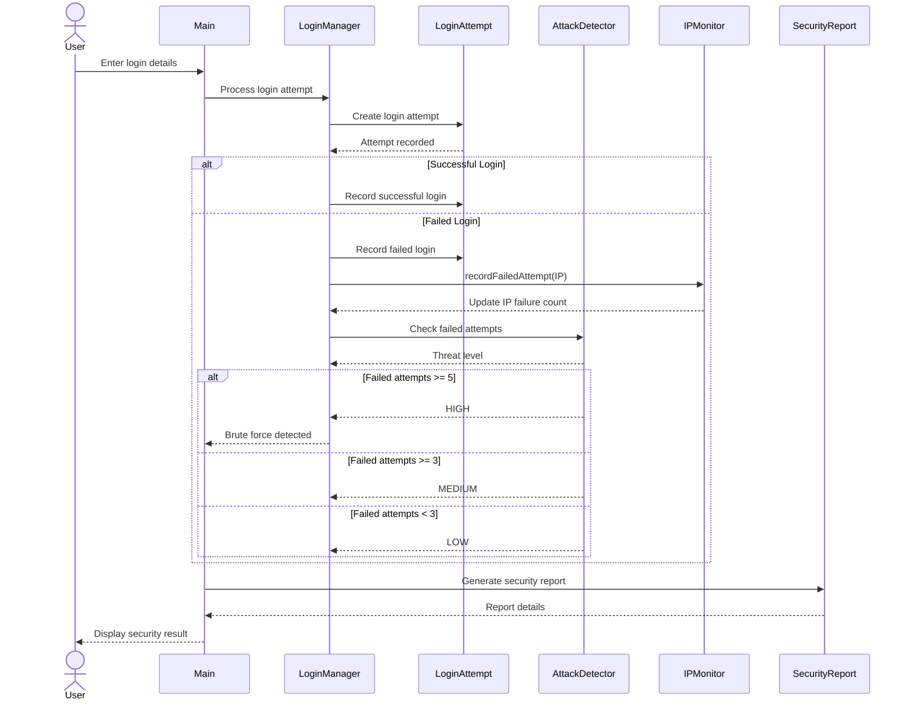

# Sequence Diagram

```mermaid
sequenceDiagram

actor User
participant Main
participant LoginManager
participant LoginAttempt
participant AttackDetector
participant IPMonitor
participant SecurityReport

User->>Main: Enter login details
Main->>LoginManager: Process login attempt

LoginManager->>LoginAttempt: Create login attempt
LoginAttempt-->>LoginManager: Attempt recorded

alt Successful Login
    LoginManager->>LoginAttempt: Record successful login
else Failed Login
    LoginManager->>LoginAttempt: Record failed login
    LoginManager->>IPMonitor: recordFailedAttempt(IP)
    IPMonitor-->>LoginManager: Update IP failure count

    LoginManager->>AttackDetector: Check failed attempts
    AttackDetector-->>LoginManager: Threat level

    alt Failed attempts >= 5
        AttackDetector-->>LoginManager: HIGH
        LoginManager-->>Main: Brute force detected
    else Failed attempts >= 3
        AttackDetector-->>LoginManager: MEDIUM
    else Failed attempts < 3
        AttackDetector-->>LoginManager: LOW
    end
end

Main->>SecurityReport: Generate security report
SecurityReport-->>Main: Report details
Main-->>User: Display security result
```
