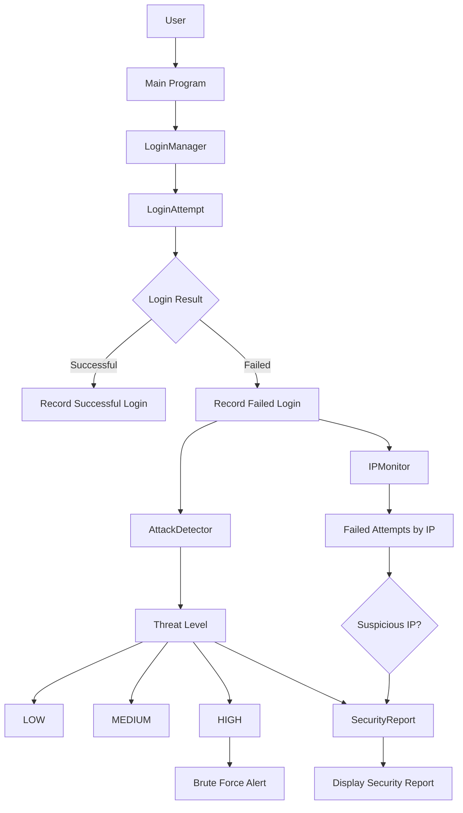

# System Architecture Diagram

```mermaid
flowchart TD
    A[User] --> B[Main Program]

    B --> C[LoginManager]

    C --> D[LoginAttempt]

    D --> E{Login Result}

    E -->|Successful| F[Record Successful Login]
    E -->|Failed| G[Record Failed Login]

    G --> H[AttackDetector]
    G --> I[IPMonitor]

    H --> J[Threat Level]
    J --> K[LOW]
    J --> L[MEDIUM]
    J --> M[HIGH]

    I --> N[Failed Attempts by IP]
    N --> O{Suspicious IP?}

    M --> P[Brute Force Alert]
    J --> Q[SecurityReport]
    O --> Q

    Q --> R[Display Security Report]
```
