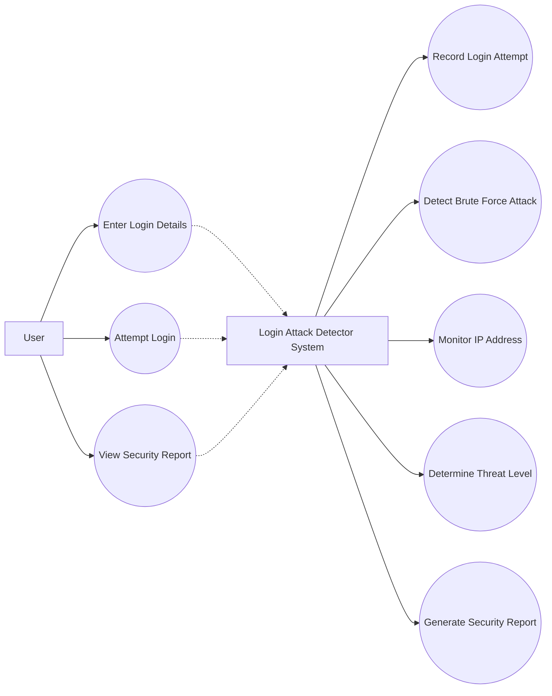

# Use Case Diagram

```mermaid
flowchart LR
    U[User]

    U --> A((Enter Login Details))
    U --> B((Attempt Login))
    U --> C((View Security Report))

    S[Login Attack Detector System]

    A -.-> S
    B -.-> S
    C -.-> S

    D((Record Login Attempt))
    E((Detect Brute Force Attack))
    F((Monitor IP Address))
    G((Determine Threat Level))
    H((Generate Security Report))

    S --> D
    S --> E
    S --> F
    S --> G
    S --> H
```
