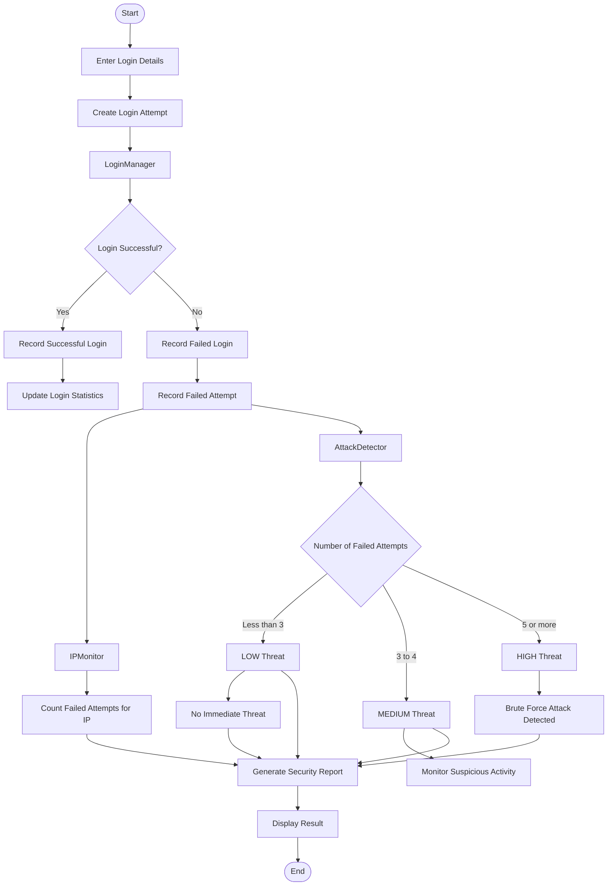

# Login Attack Detector Workflow

```mermaid
flowchart TD
    A([Start]) --> B[Enter Login Details]
    B --> C[Create Login Attempt]
    C --> D[LoginManager]
    D --> E{Login Successful?}

    E -->|Yes| F[Record Successful Login]
    E -->|No| G[Record Failed Login]

    F --> H[Update Login Statistics]
    G --> I[Record Failed Attempt]

    I --> J[IPMonitor]
    J --> K[Count Failed Attempts for IP]

    I --> L[AttackDetector]
    L --> M{Number of Failed Attempts}

    M -->|Less than 3| N[LOW Threat]
    M -->|3 to 4| O[MEDIUM Threat]
    M -->|5 or more| P[HIGH Threat]

    P --> Q[Brute Force Attack Detected]
    O --> R[Monitor Suspicious Activity]
    N --> S[No Immediate Threat]

    K --> T[Generate Security Report]
    N --> T
    O --> T
    Q --> T
    S --> T

    T --> U[Display Result]
    U --> V([End])
```
